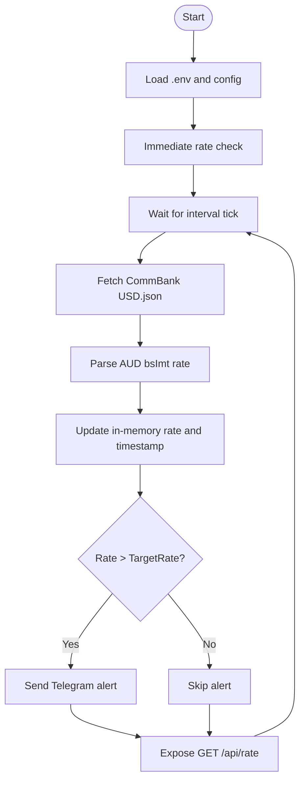
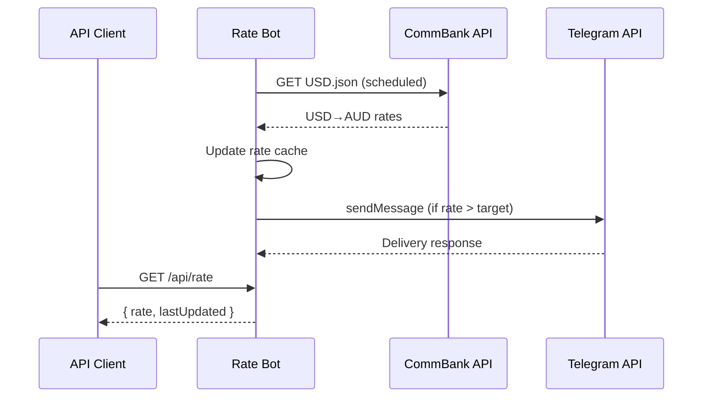

# Commonwealth Bank USD→AUD Rate Bot

A niche utility for Commonwealth Bank customers who hold a USD Foreign Currency Account and want to know the best time to convert to an AUD Smart Access account. It is currently a simple web service that polls Commonwealth Bank's published USD→AUD retail rate and optionally alerts you via Telegram when your target is reached.

## How it works
- Fetches forex data from Commonwealth Bank's JSON feed on a fixed interval (default 60 minutes).
- Extracts the USD→AUD `bsImt` buy/sell rate.
- Stores the latest rate and timestamp in memory and exposes them via a lightweight HTTP endpoint with CORS enabled.
- Sends a Telegram message when the rate crosses the configured target.

## Key components
- Poller and notifier: `server/main.go` — fetches the rate, updates shared state, and sends Telegram alerts based on `config.Config`.
- Configuration defaults: `server/config/config.go` — `TargetRate` (default 1.20) and `CheckInterval` (default 60m).
- API surface: `server/main.go` exposes `GET /api/rate` returning `{ rate, lastUpdated }` with `lastUpdated` in RFC3339 format.
- Telegram integration: driven by environment variables (`TELEGRAM_BOT_TOKEN`, `TELEGRAM_CHAT_ID`) and `github.com/joho/godotenv` for local `.env` loading.

## Run locally
1. Install Go 1.20+ (module targets Go 1.25.4).
2. From the `server` directory, create a `.env` file:
   ```env
   TELEGRAM_BOT_TOKEN=your_bot_token
   TELEGRAM_CHAT_ID=your_chat_id
   ```
3. Start the service:
   ```bash
   cd server
   go run ./...
   ```
4. Fetch the latest rate:
   ```bash
   curl http://localhost:8080/api/rate
   ```

## Telegram setup (token and chat ID)
1. Create a bot token:
   - In Telegram, search for `@BotFather`.
   - Start a chat and send `/start` if needed, then `/newbot`.
   - Follow the prompts to name your bot and choose a unique username ending in `bot`.
   - BotFather returns an HTTPS API token; place it in `TELEGRAM_BOT_TOKEN`.
2. Find your chat ID:
   - Add your new bot to a chat (or DM it) and send any message (e.g., "hi").
   - In a browser, open `https://api.telegram.org/bot<YOUR_TOKEN>/getUpdates`.
   - In the JSON response, locate `message.chat.id` — that numeric value is your `TELEGRAM_CHAT_ID`.
3. Test messaging:
   - Call `https://api.telegram.org/bot<YOUR_TOKEN>/sendMessage?chat_id=<CHAT_ID>&text=hello` in a browser or with `curl` to confirm delivery.

## Configuration
- Update `server/config/config.go` to change `TargetRate` or `CheckInterval` (e.g., make checks more frequent or tighten the alert threshold).
- Telegram alerts fire only when the fetched rate is strictly greater than `TargetRate`.
- The service keeps rates in-memory; restarting clears history.

## API
- `GET /api/rate` → `200 OK`
  ```json
  {
    "rate": 1.2345,
    "lastUpdated": "2025-01-24T12:34:56Z"
  }
  ```

## Diagrams

Flow (polling and alerting)


Sequence (serving rate and sending alert)


## Future ideas
- Persist historical rates for trend analysis and notifications on improvements beyond a trailing window.
- Add some UI for user-configurable thresholds and more.
- Expand to additional currency pairs (GBP, EUR).
